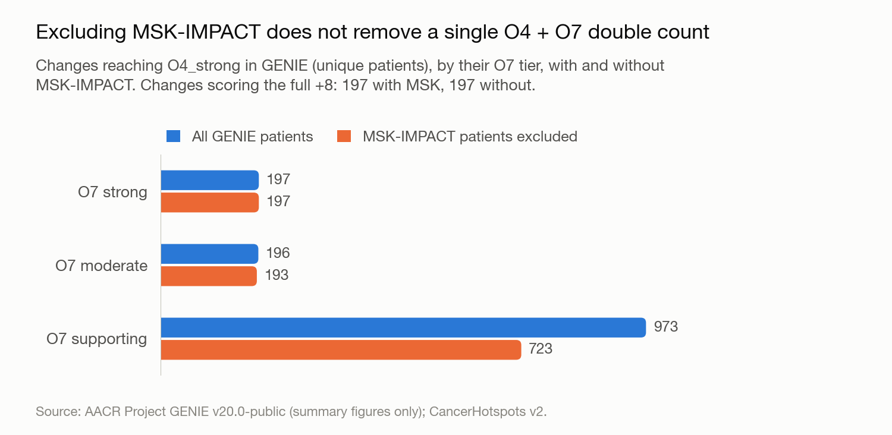
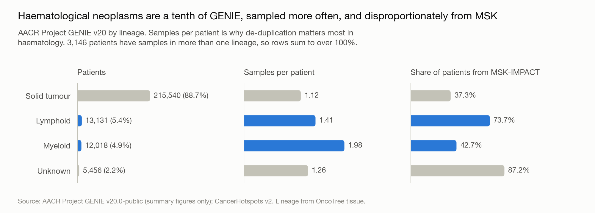

# GENIE v20 re-run — 11 September 2026

For Kevin Baker. This answers your two questions of 11 September:

1. Re-run the O4/O7 assessment on GENIE, with the GENIE counts for O4 de-duplicated so
   that multiple samples from one patient count as a single entry.
2. The haematological (myeloid / lymphoid) representation in GENIE against solid tumours.

The full write-up is **Section 8 of the report**
(<https://manuel-dominguezcbg.github.io/svig-uk-o4-o7-independence/#genie>) and section 11
of [the findings](../../docs/findings.md).

---

## In short

- **197 of the 198** amino-acid changes reaching O7_strong also reach O4_strong in GENIE,
  counted as unique patients (99.5%; COSMIC gave 98.5%).
- **All 197 still do with every MSK-IMPACT patient removed.** Excluding MSK — the
  mitigation the guideline already proposes — does not prevent a single +8. The double
  counting is definitional, not a shared-cohort artefact, so only a cap removes it.
- **The same ten changes drop from +8 to +4** under the proposed cap, and the same four are
  protected by O1. The COSMIC-based conclusions hold.
- **GENIE v20 is 4.9% myeloid and 5.4% lymphoid by patient**, 88.7% solid tumour.
  Haematological patients contribute more samples each (1.98 per myeloid patient against
  1.12 for solid tumours), so de-duplication matters most there: JAK2 p.V617F is 3,393
  samples but 1,947 patients.

## Files in this folder

| File | What it is |
|---|---|
| `fig3_genie_leave_msk_out.png` / `.tsv` | The leave-MSK-out recount, and the values plotted |
| `fig4_genie_lineage.png` / `.tsv` | GENIE by lineage: patients, samples per patient, MSK share |
| `fig1_changes_per_residue.png` / `.tsv` | Hotspot residues by number of distinct amino-acid changes (report Section 5) |
| `fig2_msk_share_per_residue.png` / `.tsv` | Hotspot residues by MSK-IMPACT share of their evidence (report Section 3) |
| `04_per_allele_o7_tiers.tsv` | **Corrected** O7 weighting for every CancerHotspots change, with its residue's positional data — replaces the version sent on 4 September |
| `03_gene_position_table.tsv` | The positional data behind report Section 5, one row per residue |

The figures are 200 dpi PNGs, suitable for slides; SVG versions are in
[`figures/`](../../figures/).

## Sent separately, by email

**`genie_o4_analysis.xlsx`** — every GENIE table (18–28), including the per-variant GENIE
patient counts, with and without MSK and split by myeloid / lymphoid / solid, for all 2,918
changes. It is not in this public repository because the GENIE data-use agreement forbids
redistribution; you have GENIE access yourself, so it can go to you directly.

## A correction

The O7 table sent on 4 September scored **synonymous** changes for O7: CancerHotspots lists
them at hotspot residues (KRAS p.G60G, 19 mutations), and 87 of the 207 had been given O7 at
supporting or moderate. O7 is reserved for missense and small in-frame variants, so they are
now marked not applicable, as nonsense and stop-loss changes already were. The corrected
`04_per_allele_o7_tiers.tsv` is in this folder. The correction changes none of the 198
changes reaching O7_strong, none of the cap-impact figures, and none of the ten changes that
drop from +8 to +4.

## If any of this goes into a presentation

Figures 3 and 4 use AACR Project GENIE v20.0-public. The GENIE terms require the citation
(AACR Project GENIE Consortium, *Cancer Discov* 2017;7(8):818–31, with the release used),
the acknowledgement text given in the report's colophon, and the AACR Project GENIE logo on
any poster or presentation.
