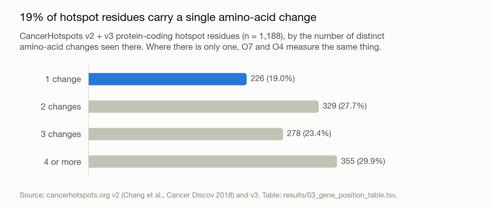
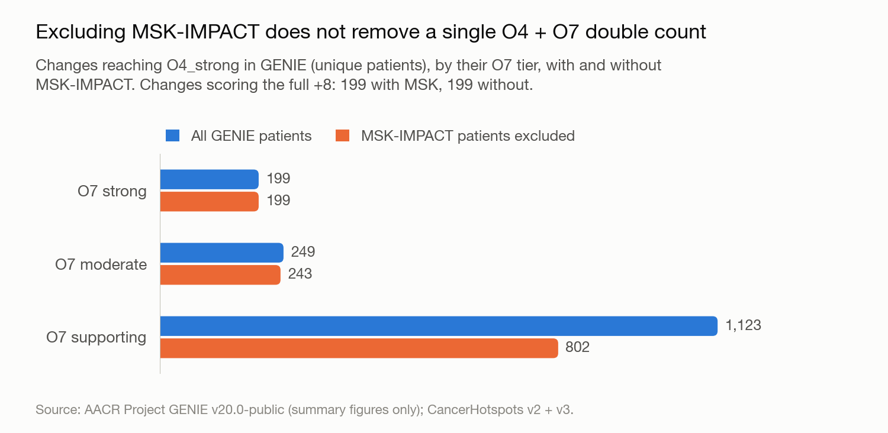

# CancerHotspots v3 added — 21 September 2026

For Kevin Baker. As requested on 21 September: the 528 changes new in CancerHotspots v3
added to the analysis and everything re-run — O7, O4 on GENIE, and the cap under both
criteria — plus the MSK / GENIE / TCGA split the v3 export gives for its new residues. It is
a separate analysis in [`analyses/v3/`](../../analyses/v3/); the v2 analysis is kept exactly
as it was.

Full write-up: [analyses/v3/README.md](../../analyses/v3/README.md).

## In short

- **The v2 part of the v3 export is identical to the v2 we already use** (2,918 of 2,918
  changes, same counts), so everything delivered so far stands.
- **v3 adds 528 changes at 164 new residues in 53 genes.** Their counts are small (largest:
  TP53 p.G199V, 32), so most reach O7 supporting (261) or moderate (58); 2 reach strong.
- **Nothing changes for the v2 changes**: O7, GENIE counts, O4 and points are identical under
  both criteria.
- **The two new O7_strong changes, TP53 p.G199V and p.G199E, keep +8 under both criteria**, so
  the changes dropping from +8 to +4 stay at **10 (permissive) and 22 (strict)**, with the
  same 4 and 9 on the O1 list.
- **For the new changes the cap costs one or two points**: of 278 scoring both O4 and O7, 201
  are capped under the permissive criterion (39 from +6 to +4, 105 from +5 to +4) and 237
  under the strict one.

## The MSK / GENIE / TCGA split at the v3 residues

| Cohort | Mutations at the 164 v3 residues | Share |
|---|---|---|
| MSK-IMPACT (a GENIE centre) | 2,641 | 37.8% |
| GENIE excluding MSK | 3,937 | 56.4% |
| TCGA (not in GENIE) | 408 | 5.8% |

**94% of the mutations recorded at the v3 residues are in GENIE**, against about half of the
v2 hotspot evidence (53% of which came from retrospective cohorts, largely TCGA). Prevalence
barely differs between cohorts (MSK vs non-MSK GENIE at 3 residues, MSK vs TCGA at 1,
adjusted p < 0.05), and the non-MSK GENIE counts match our GENIE v20 extraction closely
(ρ = 0.88).

One caveat: these columns are **not a breakdown of the evidence behind each hotspot call**, as
n_MSK / n_Retro were in v2. They total 6,986 mutations, against 2,221 in the per-change counts
O7 is scored on, and the export doesn't say which cohort the v3 calls were made on. If they
were made on these cohorts, the O7 evidence for v3 residues would come almost entirely from
GENIE — the database O4 is counted in — and excluding MSK would remove even less of the
overlap than it does for v2. Confirming that needs the method description for the v3 release.

## Files

| Where | File | What it is |
|---|---|---|
| This folder | `05_o4_o7_double_counting.tsv` | Every change (v2 + v3) with O7 and the handling under both criteria; `hotspot_version` says which release each row comes from |
| This folder | `03_gene_position_table.tsv` | Every residue (1,188), with its substitutions and counts |
| This folder | `33_v3_cohort_prevalence_by_residue.tsv`, `34_v3_cohort_prevalence_summary.tsv` | The cohort split for each v3 residue, and its totals |
| This folder | `fig1…`, `fig3…` (`.png` and `.tsv`) | The two figures above and the values plotted |
| **Email** | `genie_points_per_change.xlsx` | Points per change on GENIE for v2 + v3: O7, O4 (unique patients), and the handling and resulting points under both criteria, with O1 impact and materially affected changes |

The workbook goes by email because it contains AACR Project GENIE data at the level of
individual variants.
